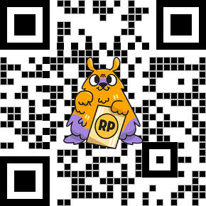

# Shimmer Alternative

[](https://github.com/protheeuz/shimmer-alternative/actions/workflows/build.yml)


Shimmer Alternative is a Flutter package designed to provide beautiful shimmer effects for loading states in your apps. This package is perfect for adding visually appealing animations to your cards, containers, text, and text fields, making the loading experience more engaging for users.

```
Properties

- `child` (Widget): The widget below this widget in the tree.
- `baseColor` (Color): The base color of the shimmer effect.
- `highlightColor` (Color): The highlight color of the shimmer effect.
- `duration` (Duration): The duration of the shimmer animation.
- `direction` (ShimmerDirection): The direction of the shimmer animation.

Properties ShimmerDirection

- `ltr`: Left to right.
- `rtl`: Right to left.
- `ttb`: Top to bottom.
- `btt`: Bottom to top.
```
## Features

- Customizable shimmer colors
- Adjustable shimmer speed
- Support for multiple directions (left-to-right, right-to-left, top-to-bottom, bottom-to-top)
- Support for multiple shapes (rectangle, circle, custom)
- Custom gradient support
- Automatic dark mode adjustment
- Easy integration with existing widgets
- Lightweight and highly customizable

## Getting Started

To use this package, add `shimmer_alternative` as a dependency in your `pubspec.yaml` file:

```yaml
dependencies:
  shimmer_alternative: ^0.0.6
```

### Usage
Here is a simple example of how to use Shimmer Alternative:

```dart
import 'package:flutter/material.dart';
import 'package:shimmer_alternative/shimmer_alternative.dart';

void main() => runApp(MyApp());

class MyApp extends StatelessWidget {
  const MyApp({Key? key}) : super(key: key);

  @override
  Widget build(BuildContext context) {
    return MaterialApp(
      theme: ThemeData.light(),
      darkTheme: ThemeData.dark(),
      themeMode: ThemeMode.system,
      home: Scaffold(
        appBar: AppBar(
          title: const Text('Shimmer Alternative Example'),
        ),
        body: Padding(
          padding: const EdgeInsets.all(8.0),
          child: Column(
            children: [
              ShimmerAlternative(
                duration: const Duration(seconds: 2),
                direction: ShimmerDirection.ttb,
                isDarkMode: true,
                child: Container(
                  width: double.infinity,
                  height: 150.0,
                  color: Colors.grey[300],
                ),
              ),
              const SizedBox(height: 20),
              ShimmerAlternative(
                duration: const Duration(seconds: 3),
                direction: ShimmerDirection.btt,
                child: const Text(
                  'Loading text...',
                  style: TextStyle(
                    fontSize: 24.0,
                    fontWeight: FontWeight.bold,
                    color: Colors.grey[300],
                  ),
                ),
              ),
              const SizedBox(height: 20),
              ShimmerAlternative(
                duration: const Duration(seconds: 1),
                direction: ShimmerDirection.rtl,
                child: const TextField(
                  decoration: InputDecoration(
                    border: OutlineInputBorder(),
                    labelText: 'Loading...',
                    fillColor: Colors.grey[300],
                    filled: true,
                  ),
                ),
              ),
              const SizedBox(height: 20),
              ShimmerAlternative(
                customGradient: const LinearGradient(
                  colors: [Colors.red, Colors.blue, Colors.green],
                  stops: [0.4, 0.5, 0.6],
                ),
                child: Container(
                  width: double.infinity,
                  height: 150.0,
                  color: Colors.grey[300],
                ),
              ),
              const SizedBox(height: 20),
              ShimmerAlternative(
                shape: ShimmerShape.custom,
                customShapeBuilder: (canvas, size, paint) {
                  Path path = Path();
                  path.moveTo(size.width * 0.5, 0);
                  path.lineTo(size.width, size.height);
                  path.lineTo(0, size.height);
                  path.close();
                  canvas.drawPath(path, paint);
                },
                child: Container(
                  width: double.infinity,
                  height: 150.0,
                  color: Colors.grey[300],
                ),
              ),
            ],
          ),
        ),
      ),
    );
  }
}
```

### Customization
Shimmer Colors
You can customize the base color and highlight color of the shimmer effect:

```dart
ShimmerAlternative(
  baseColor: Colors.grey[300]!,
  highlightColor: Colors.grey[100]!,
  child: Container(
    width: double.infinity,
    height: 150.0,
    color: Colors.grey[300],
  ),
);
```

### Shimmer Speed
You can adjust the speed of the shimmer effect by changing the duration parameter:

```dart
ShimmerAlternative(
  duration: Duration(seconds: 2),
  child: Container(
    width: double.infinity,
    height: 150.0,
    color: Colors.grey[300],
  ),
);
```

### Shimmer Direction
You can change the direction of the shimmer effect using the direction parameter:

```dart
ShimmerAlternative(
  direction: ShimmerDirection.ttb,
  child: Container(
    width: double.infinity,
    height: 150.0,
    color: Colors.grey[300],
  ),
);
```

### Shimmer Shape
You can change the shape of the shimmer effect using the shape parameter:

```dart
ShimmerAlternative(
  shape: ShimmerShape.circle,
  child: Container(
    width: 100.0,
    height: 100.0,
    color: Colors.grey[300],
  ),
);
```

### Shimmer Gradient
You can use a custom gradient for the shimmer effect by setting the customGradient parameter:

```dart
ShimmerAlternative(
  customGradient: LinearGradient(
    colors: [Colors.red, Colors.blue, Colors.green],
    stops: [0.4, 0.5, 0.6],
  ),
  child: Container(
    width: double.infinity,
    height: 150.0,
    color: Colors.grey[300],
  ),
);
```

### Dark Mode Adjustment
You can automatically adjust the colors for dark mode by setting the isDarkMode parameter:

```dart
ShimmerAlternative(
  isDarkMode: true,
  child: Container(
    width: double.infinity,
    height: 150.0,
    color: Colors.grey[300],
  ),
);
```

### Custom Shape
You can define a custom shape for the shimmer effect by using the customShapeBuilder parameter:

```dart
ShimmerAlternative(
  shape: ShimmerShape.custom,
  customShapeBuilder: (canvas, size, paint) {
    Path path = Path();
    path.moveTo(size.width * 0.5, 0);
    path.lineTo(size.width, size.height);
    path.lineTo(0, size.height);
    path.close();
    canvas.drawPath(path, paint);
  },
  child: Container(
    width: double.infinity,
    height: 150.0,
    color: Colors.grey[300],
  ),
);
```

## FAQ

**Q: How do I customize the shimmer colors?**

A: You can customize the shimmer colors by setting the baseColor and highlightColor properties.

**Q: How do I change the speed of the shimmer animation?**

A: You can change the speed by setting the duration property.

**Q: Can I use ShimmerAlternative with other widgets like ListView or GridView?**

A: Yes, you can use ShimmerAlternative with any widget.

**Q: How do I use custom shapes in the shimmer effect?**

A: You can set the shape property to ShimmerShape.custom and implement custom drawing logic in the customShapeBuilder callback.

**Q: How do I use a custom gradient for the shimmer effect?**

A: You can set the customGradient property to define a custom gradient.

**Q: How do I enable dark mode adjustment?**

A: You can set the isDarkMode property to true to automatically adjust the colors for dark mode.


## Support the Project
If you find this project useful and would like to support its ongoing development, consider making a donation.

[](https://www.paypal.com/paypalme/iqbalfauzien)
[PayPal](https://www.paypal.com/paypalme/iqbalfauzien)


[Saweria](https://saweria.co/iqbalfauzien)



## Contribution Guidelines

Thank you for considering contributing to Shimmer Alternative! Here are some guidelines to help you get started:

1. Fork the repository.
2. Create a new branch (`git checkout -b feature/your-feature`).
3. Make your changes.
4. Commit your changes (`git commit -m 'Add some feature'`).
5. Push to the branch (`git push origin feature/your-feature`).
6. Create a new Pull Request.

Please ensure your pull request adheres to the following guidelines:
- Describe the changes in detail.
- Update documentation if needed.
- Write tests for new features.
- Ensure code passes all tests and lints.

### Contributing
Contributions are welcome! If you have any ideas, suggestions, or find a bug, please create an issue or submit a pull request.

License
This project is licensed under the GPL-3.0 license - see the [LICENSE](https://github.com/protheeuz/shimmer-alternative?tab=GPL-3.0-1-ov-file#GPL-3.0-1-ov-file) file for details.